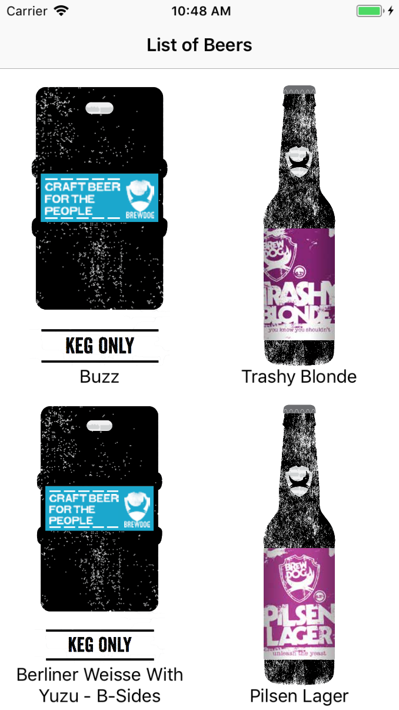
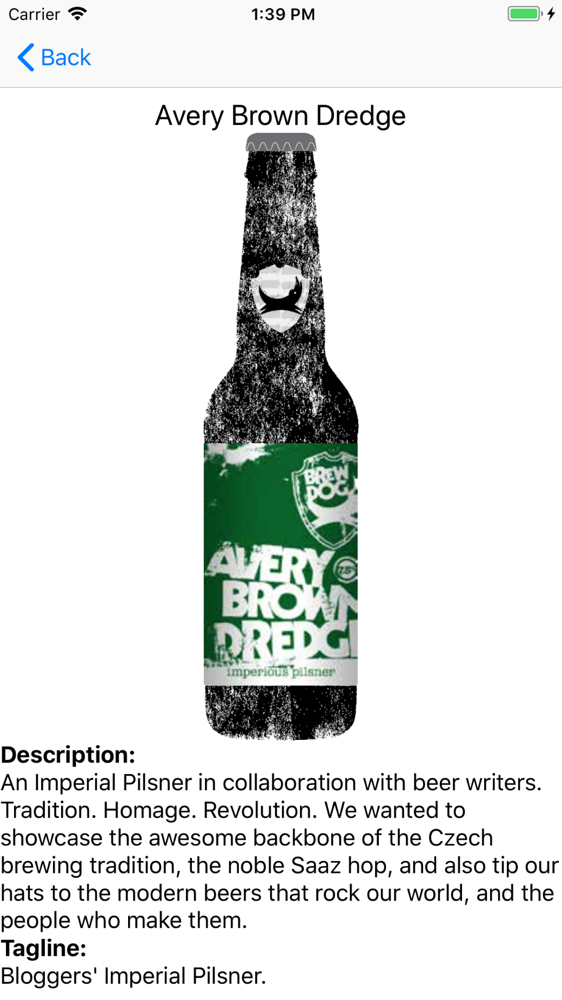
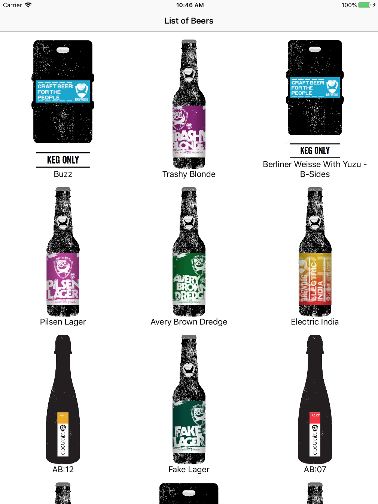
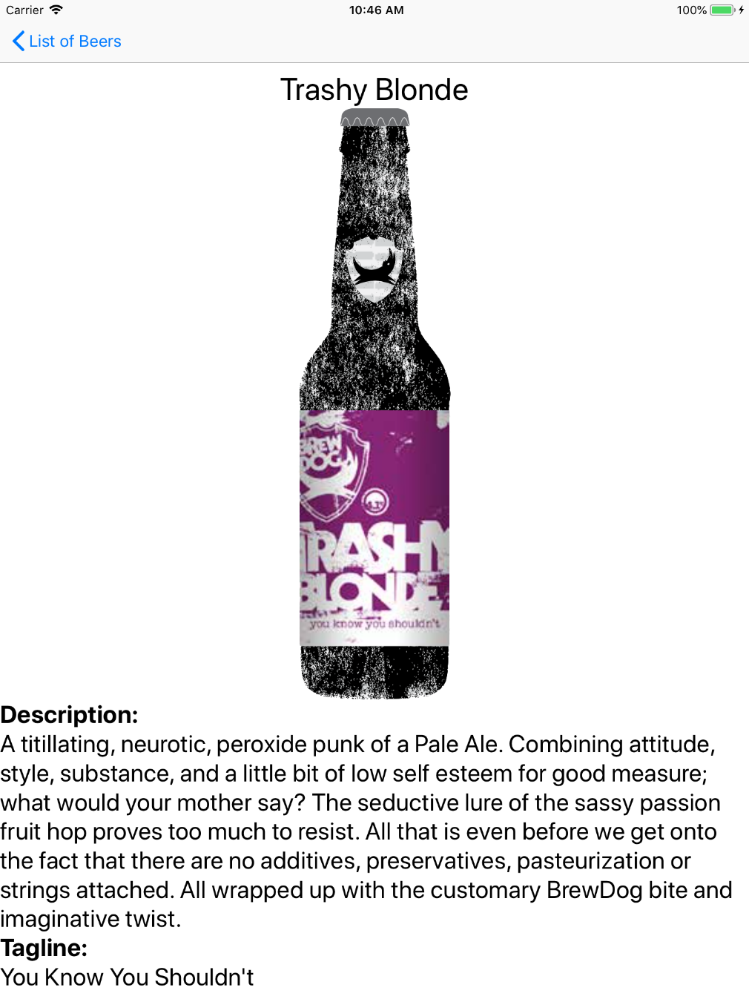

# IOS_CollectionView_tutorial

The project uses [Punk API] (https://punkapi.com), as a data soruce for the collection view. The project has two screens, a list screen and detail screen. The list screen displays the list of beers names and their images in a grid view format. When the image is clicked on, the detail screen appears. The detail screen provides more information such as the description and tagline of the selected beer. 

# Screenshots
The screenshots below show the screens with a compact width.

The screenshots below show the screens with a regular width.

